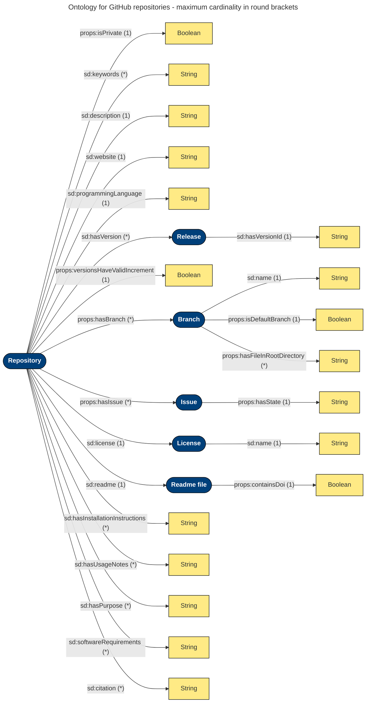

<p align="center">
    
    <br>
</p>
    
<h2 align="center">QuaRe: Validate your GitHub Repositories against Quality Criteria</h2>

<p align="center">
    <a href="#summary">Summary</a>
    •
    <a href="#installation-and-prerequisites">Installation and Prerequisites</a>
    •
    <a href="#usage">Usage</a>
    •
    <a href="#repository-representation-ontology">Repository Representation Ontology</a>
    •
    <a href="#developer-information">Developer Information</a>
    •
    <a href="#citation">Citation</a>
    •
    <a href="#license">License</a>
</p>

## Summary

QuaRe is a single-page application that allows users to test if GitHub repositories of interest comply with certain quality criteria that they should fulfill according to the type of project in the repository. 

## Installation and Prerequisites

Thanks to Docker, only [Docker](https://www.docker.com/) and [Docker Compose](https://docs.docker.com/compose/install/) are required for using the tool.

## Usage 

After cloning or downloading this repository, simply run `docker compose up` in a command line from the root folder of the repository to start the tool. The frontend can then be accessed via [http://localhost:3000](http://localhost:3000). (If necessary, the backend can be accessed via [http://localhost:5000](http://localhost:5000).)

The frontend currently provides two pages, namely the [Validation page](#the-validation-page) and the [Specification page](#the-specification-page) which can be selected using the navigation bar.

### The Validation Page

Here you can enter the names of the repositories you want to validate against the available project types. If you plan to validate private repositories or want to make multiple requests in short succession, make sure to also enter a GitHub access token, which can be generated in the settings of your GitHub profile (reading rights suffice here).

When you have filled out the form, you can issue the validation of the specified repositories. If the validation succeeds a green symbol is presented, otherwise a red symbol is shown. You can view the explanations (one raw and a verbalized one) by pressing the button next to the red symbols.

### The Specification Page

Here you can view the available project types and the quality constraints that are assigned to them. In the future, it is planned that the project types and criteria can be edited directly here. Currently, you have to edit the SHACL shapes graph manually.

## Repository Representation Ontology
A representation of the given repository is created for validation. Its individual components depend on the corresponding project type. The following visualization shows all possible nodes and edges of this ontology. IRIs (Internationalized Resource Identifiers) are depicted in blue, literals in yellow. 


The IRIs mentioned have the following URL structure:
* Repository: `https://github.com/<user_or_organization_name>/<repository_name>`
* Release: `<repository_URL>/releases/tag/<tag_name>`
* Branch: `<repository_URL>/tree/<branch_name>`
* Issue: `<repository_URL>/issues/<issue_id>`
* License: `<repository_URL>/blob/<path_to_license_file>`
* Readme file: `<repository_URL>/blob/<path_to_readme_file>`

## Developer Information

Instead of running frontend and backend using `docker compose up`, you can run backend and frontend independently for easier debugging.
### Running the Backend

- Run `docker compose run --service-ports --entrypoint bash backend` to get a bash that is attached to the backend container.
- Run `./api.py` to start the backend. 

### Running the Frontend

- Run `docker compose run --service-ports --entrypoint bash frontend` to get a bash that is attached to the frontend container.
- Run `npm run dev` to start the backend in development mode. 

Note that the frontend depends on the backend. The backend should therefore be started first.

### Evaluation

WARNING: Rerunning the evaluation will overwrite the results that are provided in the repository!

To reproduce the evaluation results discussed in the SEMANTiCS 2024 paper, perform the following steps: 

- Create a file called `.github_access_token` in the [backend](./backend/) folder. Then, enter your GitHub access token in that file and save. 
- Run `docker compose run evaluation` to get a bash that is attached to the backend container.
- Run `./python3 evaluation.py` to rerun the evaluation. This includes the FAIRness assessment of GitHub repositories and the runtime benchmark on the same repositories.

The resulting files are placed in the [evaluation](./backend/data/evaluation/) folder.

## Citation
If you use this software, please cite it as below:

```bibtex
@inproceedings{DBLP:conf/lwa/MartinH22,
  author       = {Leon Martin and
                  Andreas Henrich},
  editor       = {Pascal Reuss and
                  Viktor Eisenstadt and
                  Jakob Michael Sch{\"{o}}nborn and
                  Jero Sch{\"{a}}fer},
  title        = {Specification and Validation of Quality Criteria for Git Repositories
                  using {RDF} and {SHACL}},
  booktitle    = {Proceedings of the {LWDA} 2022 Workshops: FGWM, FGKD, and FGDB, Hildesheim
                  (Germany), Oktober 5-7th, 2022},
  series       = {{CEUR} Workshop Proceedings},
  volume       = {3341},
  pages        = {124--135},
  publisher    = {CEUR-WS.org},
  year         = {2022},
  url          = {https://ceur-ws.org/Vol-3341/WM-LWDA\_2022\_CRC\_1149.pdf},
  timestamp    = {Sat, 30 Sep 2023 09:52:13 +0200},
  biburl       = {https://dblp.org/rec/conf/lwa/MartinH22.bib},
  bibsource    = {dblp computer science bibliography, https://dblp.org}
}
```

## Citation
If you use this software, please cite it as below:

```bibtex
@inproceedings{DBLP:conf/lwa/MartinH22,
  author       = {Leon Martin and
                  Andreas Henrich},
  editor       = {Pascal Reuss and
                  Viktor Eisenstadt and
                  Jakob Michael Sch{\"{o}}nborn and
                  Jero Sch{\"{a}}fer},
  title        = {Specification and Validation of Quality Criteria for Git Repositories
                  using {RDF} and {SHACL}},
  booktitle    = {Proceedings of the {LWDA} 2022 Workshops: FGWM, FGKD, and FGDB, Hildesheim
                  (Germany), Oktober 5-7th, 2022},
  series       = {{CEUR} Workshop Proceedings},
  volume       = {3341},
  pages        = {124--135},
  publisher    = {CEUR-WS.org},
  year         = {2022},
  url          = {https://ceur-ws.org/Vol-3341/WM-LWDA\_2022\_CRC\_1149.pdf},
  timestamp    = {Sat, 30 Sep 2023 09:52:13 +0200},
  biburl       = {https://dblp.org/rec/conf/lwa/MartinH22.bib},
  bibsource    = {dblp computer science bibliography, https://dblp.org}
}
```

## License

See [License](./LICENSE/)
