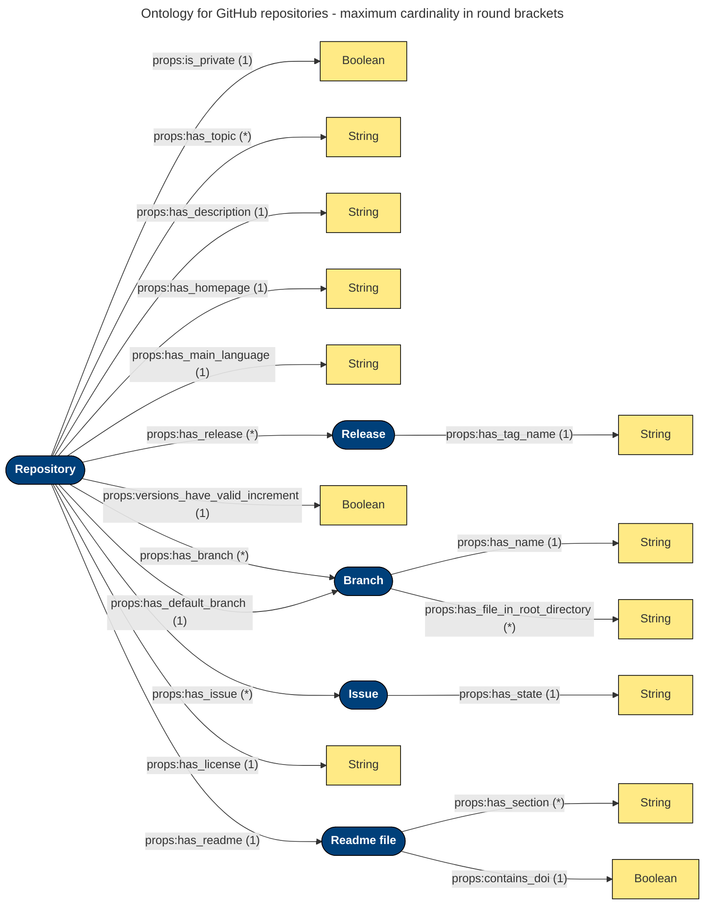

    
     

    
<h2 align="center">QuaRe: Validate your GitHub Repositories against Quality Criteria</h2>

    <a href="#summary">Summary</a>
    •
    <a href="#installation">Installation</a>
    •
    <a href="#usage">Usage</a>
    •
    <a href="#developer-information">Developer Information</a>
    •
    <a href="#license">License</a>

## Summary

QuaRe is a single-page application that allows users to test if GitHub repositories of interest comply with certain quality criteria that they should fulfill according to the type of project in the repository. 

## Installation

Thanks to Docker, only [Docker](https://www.docker.com/) and [Docker Compose](https://docs.docker.com/compose/install/) have to be installed for using the tool.

## Usage 

After cloning or downloading this repository, simply run `docker compose up` in a command line from the root folder of the repository to start the tool. The frontend can then be accessed it via [http://localhost:3000](http://localhost:3000). (If necessary, the backend can be accessed via [http://localhost:5000](http://localhost:5000).)

The frontend currently provides two pages, namely the [Validation page](#the-validation-page) and the [Specification page](#the-specification-page) which can be selected using the navigation bar.

### The Validation Page

Here you can enter the names of the repositories you want to validate against the available project types. If you plan to validate private repositories or want to make multiple requests in short succession, make sure to also enter a GitHub access token, which can be generated in the settings of your GitHub profile (reading rights suffice here).

When you have filled out the form, you can issue the validation of the specified repositories. For the validation, you can choose between the SHACL and the OWL approach using the provided switch. We recommend the SHACL approach due to the comprehensive explanations it provides in case the validation fails. If the validation succeeds a green symbol is presented, otherwise a red symbol is shown. You can view the explanations (one raw and a verbalized one) by pressing the button next to the red symbols.

### The Specification Page

Here you can view the available project types and the quality constraints that are assigned to them. In the future, it is planned that the project types and criteria can be edited directly here. Currently, you have to edit the SHACL shapes graph or the ontology manually. If you want to change the criteria or add other project types, we strongly recommend editing the shapes graph and thereby using the SHACL approach because this is far easier than editing the ontology.  

## Ontology used for the representation of repositories
A representation of the given repository is created for validation. Its individual components depend on the corresponding project type. The following diagram shows all possible nodes and edges of this ontology. IRIs (Internationalized Resource Identifiers) are depicted in blue, literals in yellow. 

## Developer Information

Instead of running frontend and backend using `docker compose up`, you can run backend and frontend independently for easier debugging.
### Running the Backend

- Run `docker compose run --service-ports --entrypoint bash backend` to get a bash that is attached to the backend container.
- Run `./api.py` to start the backend. 

### Running the Frontend

- Run `docker compose run --service-ports --entrypoint bash frontend` to get a bash that is attached to the frontend container.
- Run `npm run dev` to start the backend in development mode. 

Note that the frontend depends on the backend. The backend should therefore be started first.

### Benchmarks

To reproduce the performance benchmarks shown in the paper, perform the following steps: 

- Create a file called `github_access_token` in the [backend](./backend/) folder. Then enter your GitHub access token and that file and save. 
- Run `docker compose run --service-ports --entrypoint bash backend` to get a bash that is attached to the frontend container.
- Run `./benchmark.py` to start the backend in development mode. 

## License

See [License](./LICENSE/)
